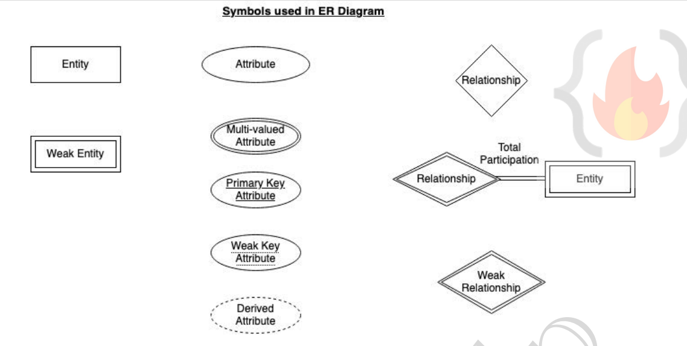
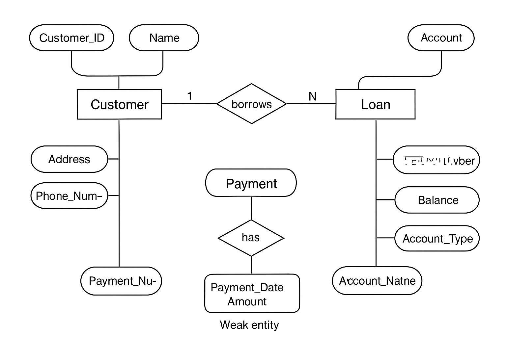

Great! Let’s start **step by step**. We’ll begin with the very first topic:

---

## **1️⃣ Data Model**

### **Definition:**

A **Data Model** is like a **toolkit** for describing **data**, **how data relates to each other**, **the meaning of data**, and **rules that data must follow** (consistency constraints).

Think of it as a **blueprint or map of a database**. Just like an architect needs a blueprint to build a house correctly, a database designer needs a data model to organize data efficiently.

---

### **Key Points:**

1. **Describes Data:** What information is stored (e.g., student name, ID, courses).
2. **Describes Relationships:** How entities are connected (e.g., student enrolls in a course).
3. **Describes Semantics:** What the data actually means (e.g., "Age" is a number representing years).
4. **Consistency Rules:** Constraints like “A student ID must be unique” or “A course must have a valid instructor”.

---

### **Real-Life Example:**

Imagine a **library**:

* **Data:** Book title, author, ISBN, member ID, issue date.
* **Relationships:** Member borrows book; author writes book.
* **Rules:** One copy of a book cannot be issued to two members at the same time; ISBN must be unique.

The **data model** helps the library keep track of all these things in an organized way so it can be **efficiently managed and queried**.

---

### **Placement Tip:**

* Interviewers often ask:
  *“What is a data model?”*

  * Answer: “A data model is a conceptual tool used to **define, organize, and relate data**, ensuring consistency and meaningful storage in a database.”

* Or: *“Why is a data model important?”*

  * Answer: “It acts as a **blueprint** for database design, ensuring data is stored correctly, relationships are clear, and constraints are enforced.”

---

✅ **Summary:**
A **data model** = blueprint + rules + relationships + meaning of data. Without it, building a database is like constructing a building without a plan.

---

Perfect! Let’s dive into the **ER Model**.

---

## **2️⃣ ER Model (Entity-Relationship Model)**

### **Definition:**

The **ER Model** is a **high-level conceptual data model** that represents the **real-world objects** (called **entities**) and the **relationships** among them.

Think of it as a **map of the database** showing entities, their attributes, and how they connect — before actually creating the database.

The **graphical representation** of the ER Model is called an **ER Diagram**, which acts like a **blueprint** for the database.

---

### **Key Components:**

#### **1. Entity**

An **entity** is a **“thing” or “object”** in the real world that can be **uniquely identified**.

* **Physical existence example:** A car, a student, a book.
* **Abstract existence example:** A course, a loan.

**Example in a college:**

* Each student = an **entity**
* Each book in a library = an **entity**

#### **Types of Entities**

1. **Strong Entity:** Can be uniquely identified by a **primary key**.

   * Example: Student (Student\_ID)
2. **Weak Entity:** **Cannot be uniquely identified alone** and depends on a **strong entity**.

   * Example: **Payment** depends on **Loan**.
   * Payments can’t exist without a Loan; each payment may not have a unique identifier globally but is unique **for that loan**.

---

#### **2. Entity Set**

* A **collection of similar entities** sharing the same attributes.
* Example: All students in a college = **Student entity set**
* All customers in a bank = **Customer entity set**

---

#### **3. Attributes**

* Properties of an entity.
* Each attribute has **a domain** (set of allowed values).

**Example: Student Entity**

* Attributes: Student\_ID, Name, Standard, Course, Batch, Contact Number, Address

**Types of Attributes:**

1. **Simple:** Cannot be divided (e.g., Roll number)
2. **Composite:** Can be divided into subparts (e.g., Name → First, Middle, Last)
3. **Single-valued:** Only one value (e.g., Student\_ID)
4. **Multi-valued:** Multiple values possible (e.g., Phone numbers, dependent names)
5. **Derived:** Can be calculated from other attributes (e.g., Age from Date of Birth)
6. **NULL:** Missing or unknown value (e.g., middle name may be NULL)

---

### **Real-Life Example of ER Model:**

**Scenario:** Online shopping website

* **Entities:** Customer, Product, Order
* **Attributes:**

  * Customer → Customer\_ID, Name, Email
  * Product → Product\_ID, Name, Price
  * Order → Order\_ID, Date, Total
* **Relationships:**

  * Customer places Order
  * Order contains Product

**ER Diagram** would show:

* Boxes for entities
* Ovals for attributes
* Diamonds for relationships

---

### **Placement Tip:**

* Common interview questions:

1. *“What is an ER Model?”*

   * Answer: “It is a **high-level conceptual model** representing **entities, their attributes, and relationships**, typically depicted using an ER diagram.”
2. *“Difference between strong and weak entity?”*

   * Strong: has a primary key; Weak: depends on strong entity for identification.

---

✅ **Summary:**

* **ER Model = blueprint of database**
* Shows **entities, attributes, relationships**
* Helps in **database design** before implementation

---

Great! Let’s move to **Strong Entity vs Weak Entity**.

---

## **3️⃣ Strong Entity vs Weak Entity**

### **1. Strong Entity**

A **Strong Entity** is an entity that **can be uniquely identified by its own attributes** (primary key).

* **Key Characteristics:**

  1. Has a **primary key** (unique identifier)
  2. Independent of other entities
* **Examples:**

  * **Student** → Student\_ID
  * **Book** → ISBN
  * **Loan** → Loan\_ID

**Real-Life Example:**

* A **library book** is a strong entity because each book has a unique **ISBN**, and it exists independently.

---

### **2. Weak Entity**

A **Weak Entity** is an entity that **cannot be uniquely identified by its own attributes**. It **depends on a strong entity**.

* **Key Characteristics:**

  1. Doesn’t have a primary key on its own
  2. Depends on a **strong entity** (owner)
  3. Often has a **partial key** (or discriminator) that, combined with the owner, becomes unique

* **Examples:**

  * **Payment** depends on **Loan**
  * **Order Item** depends on **Order**

**Real-Life Example:**

* **Payments for a loan**:

  * Each installment may just have a **sequence number** (1, 2, 3…), but to identify it uniquely, you need the **Loan\_ID** as well.

---

### **Difference Table (Placement-Friendly)**

| Feature        | Strong Entity           | Weak Entity                                 |
| -------------- | ----------------------- | ------------------------------------------- |
| Identification | Has its own primary key | Depends on strong entity for identification |
| Existence      | Independent             | Cannot exist without strong entity          |
| Example        | Student, Book, Loan     | Payment, Order Item                         |
| Key            | Primary key             | Partial key + Owner key (composite key)     |

---

### **Real-Life Analogy:**

* Strong Entity → **Person**
* Weak Entity → **Passport renewal records**

  * The records don’t make sense without the person.
  * A renewal ID alone is not enough; you need the **Person\_ID** to identify it uniquely.

---

### **Placement Tip:**

* Interview question:
  *“Can you give an example of weak entity?”*

  * Answer: “**Payment** is a weak entity because it depends on **Loan**, which is a strong entity. Each payment can’t be uniquely identified without the loan it belongs to.”

---

Perfect! Let’s dive into **Entity Set**.

---

## **4️⃣ Entity Set**

### **Definition:**

An **Entity Set** is a **collection of entities of the same type** that **share the same attributes**.

* Think of it as a **group or table** in a database.
* Each member of the entity set is an **instance of the entity**.

---

### **Key Points:**

1. Represents **all entities of a particular type**.
2. Each entity in the set has the **same attributes**, but the **values differ**.
3. Helps organize entities in **logical groups** for database design.

---

### **Examples:**

#### **1. Student Entity Set**

* **Entity:** Student
* **Attributes:** Student\_ID, Name, Standard, Course, Batch, Contact Number, Address
* **Entity Set:** All students in a college.

  * Each row in the set represents **one student**.

#### **2. Bank Customer Entity Set**

* **Entity:** Customer
* **Attributes:** Customer\_ID, Name, Account Number, Balance
* **Entity Set:** All customers of a bank.

---

### **Real-Life Analogy:**

* Think of a **classroom**:

  * Each **student** = entity
  * All students in **class 10** = entity set
* Think of a **library**:

  * Each **book** = entity
  * All books in the library = entity set

---

### **Placement Tip:**

* Interview question:
  *“What is an entity set?”*

  * Answer: “An entity set is a **collection of similar entities** that share the same attributes. For example, all students in a college form the Student entity set.”

* Another question:
  *“Difference between entity and entity set?”*

  * Entity = one object (one student)
  * Entity Set = group of objects (all students)

---

✅ **Summary:**

* **Entity** = single object (e.g., a student)
* **Entity Set** = collection of entities (e.g., all students in the college)
* Makes it easier to organize and manage **real-world objects** in a database.

---

Great! Let’s dive into **Attributes**.

---

## **5️⃣ Attributes**

### **Definition:**

An **attribute** is a **property or characteristic of an entity**.

* It defines **what information is stored** about an entity.
* Every entity has **one or more attributes**.

---

### **Key Points:**

1. **Attributes hold values** for each entity.
2. Each attribute has a **domain** – the set of allowed values.

   * Example: Age → integers between 0–120
   * Student Name → string

---

### **Example: Student Entity**

* **Entity:** Student

* **Attributes:**

  * Student\_ID
  * Name
  * Standard
  * Course
  * Batch
  * Contact Number
  * Address

* Each student has a **specific value** for each attribute.

---

### **Types of Attributes**

1. **Simple Attribute**

   * Cannot be divided further.
   * Example: Roll number, Account number

2. **Composite Attribute**

   * Can be divided into smaller sub-parts.
   * Example: Name → First Name, Middle Name, Last Name
   * Address → Street, City, State, PIN

3. **Single-valued Attribute**

   * Holds **only one value**.
   * Example: Student\_ID, Loan\_Number

4. **Multi-valued Attribute**

   * Holds **multiple values**.
   * Example: Phone numbers, Nominee names, Dependent names
   * Limits can be applied (upper/lower limit)

5. **Derived Attribute**

   * Value can be **calculated from other attributes**.
   * Example: Age from Date of Birth, Loan Age from Loan Date

6. **NULL Value**

   * Attribute has **no value**.
   * Can mean:

     1. Not applicable → e.g., Middle name may not exist
     2. Unknown → e.g., Salary not known yet

---

### **Real-Life Examples:**

* **Library Management System:**

  * Book entity → Attributes: Book\_ID, Title, Author, Published\_Year
  * Member entity → Attributes: Member\_ID, Name, Contact Number

* **Banking System:**

  * Customer entity → Attributes: Customer\_ID, Name, Address, Multiple Phone Numbers (multi-valued)

---

### **Placement Tip:**

* Interviewers often ask:

  1. *“What is an attribute?”*

     * Answer: “An attribute is a property or characteristic of an entity, like Name, ID, or Address of a Student.”
  2. *“What are types of attributes?”*

     * Be ready to explain **Simple, Composite, Single-valued, Multi-valued, Derived, and NULL attributes** with examples.

---

✅ **Summary:**

* Attributes define **what information is stored** for entities
* Can be **simple, composite, single/multi-valued, derived, or NULL**
* Critical for **database design** because they form the columns in tables.

---

Perfect! Let’s move on to **Relationships**.

---

## **6️⃣ Relationships**

### **Definition:**

A **relationship** represents an **association between two or more entities**.

* It shows **how entities are connected** in the real world.
* Relationships are an essential part of the **ER Model**, helping to represent interactions between entities.

---

### **Key Points:**

1. Relationships **link entities** together.
2. Can be **strong** (between independent entities) or **weak** (involving a weak entity).
3. Each relationship can have **attributes** as well.

---

### **Examples of Relationships:**

1. **Person has Vehicle** → Person and Vehicle entities
2. **Parent has Child** → Parent and Child entities
3. **Customer borrows Loan** → Customer and Loan entities

---

### **Types of Relationships**

1. **Strong Relationship:**

   * Between **independent entities**
   * Example: Student **takes** Course

2. **Weak Relationship:**

   * Between a **weak entity and its owner**
   * Example: Loan → Payment
   * Payments cannot exist without the loan

---

### **Degree of Relationships**

* Refers to **number of entities participating** in a relationship:

1. **Unary (1 entity):**

   * Only **one entity participates**
   * Example: Employee **manages** Employee

2. **Binary (2 entities):**

   * **Two entities participate**
   * Example: Student **takes** Course
   * **Most common type**

3. **Ternary (3 entities):**

   * **Three entities participate**
   * Example: Employee **works-on** Branch, Employee **works-on** Job

---

### **Real-Life Example:**

**Online Shopping System**

* **Entities:** Customer, Order, Product
* **Relationships:**

  * Customer **places** Order
  * Order **contains** Product
* **Degree:** Binary (Customer–Order), Binary (Order–Product)

---

### **Placement Tip:**

* Interview Questions:

  1. *“What is a relationship?”*

     * Answer: “A relationship represents an association between two or more entities in the real world, e.g., Customer borrows Loan.”
  2. *“Types of relationships?”*

     * Unary, Binary, Ternary

---

✅ **Summary:**

* Relationships **connect entities**
* Can be **strong or weak**
* Degree = number of participating entities
* ER Diagrams represent them as **diamonds** connecting entity boxes

---

Great! Let’s move to **Relationship Constraints**.

---

## **7️⃣ Relationship Constraints**

Relationship constraints define **rules about how entities participate in a relationship**.
They ensure **consistency** in the database and describe **how many entities are associated with each other**.

There are **two main types**:

---

### **A. Mapping Cardinality (Cardinality Ratio)**

* **Definition:** Number of entities in one entity set that can be **associated with entities in another entity set**.
* **Types:**

1. **One-to-One (1:1)**

   * An entity in A associates with **at most one entity in B**, and vice versa.
   * Example: **Citizen – Aadhar Card**

     * Each citizen has one Aadhar
     * Each Aadhar belongs to one citizen

2. **One-to-Many (1\:N)**

   * An entity in A associates with **many entities in B**, but entity in B associates with **at most one in A**.
   * Example: **Citizen – Vehicle**

     * One citizen can have many vehicles
     * Each vehicle belongs to one citizen

3. **Many-to-One (N:1)**

   * Reverse of 1\:N
   * Example: **Course – Professor**

     * Many courses can be taken by one professor
     * Each course has one professor

4. **Many-to-Many (M\:N)**

   * Entities in A and B can associate **with many entities in the other set**
   * Example:

     * Customer **buys** Product
     * Student **attends** Course

---

### **B. Participation Constraints (Minimum Cardinality)**

* **Definition:** Specifies **whether all entities participate in a relationship**.
* **Types:**

1. **Partial Participation**

   * Not all entities are involved
   * Example: Customer may or may not borrow a loan

2. **Total Participation**

   * Every entity **must participate in at least one relationship instance**
   * Example: Payment (weak entity) has **total participation** with Loan — it cannot exist without a Loan

**Rule of Thumb:**

* **Weak entities always have total participation**
* **Strong entities may have partial participation**

---

### **Real-Life Example:**

**Bank System**

* Entities: Customer, Loan, Payment
* **Relationships:**

  * Customer **borrows** Loan (1\:N)
  * Loan **has** Payment (weak entity, total participation)

---

### **Placement Tip:**

* Interview Questions:

1. *“Explain types of cardinality with examples.”*

   * Give simple real-life examples like Citizen-Aadhar (1:1), Citizen-Vehicle (1\:N), Course-Professor (N:1), Customer-Product (M\:N)
2. *“What is participation constraint?”*

   * Answer: “It specifies whether all entities in an entity set must participate in a relationship. Partial = not all, Total = all must participate.”

---

✅ **Summary:**

* **Cardinality:** How many entities relate to others (1:1, 1\:N, N:1, M\:N)
* **Participation:** Whether entities must participate (Partial or Total)
* **Weak entities always have total participation**

---

We have now **covered all the major topics in your Lecture 3 notes**:

* Data Model
* ER Model
* Entity & Entity Set
* Attributes
* Relationships
* Relationship Constraints

---



---

Perfect! Let’s create a **complete ER Diagram example** using a **real-life scenario** that covers all Lecture 3 concepts.

We’ll use a **Bank System** as our scenario:

---

## **ER Diagram Scenario: Bank System**

### **Entities & Attributes**

1. **Customer (Strong Entity)**

   * Attributes: Customer\_ID (PK), Name, Address, Phone\_Number (multi-valued)

2. **Loan (Strong Entity)**

   * Attributes: Loan\_ID (PK), Amount, Loan\_Date, Duration

3. **Payment (Weak Entity)**

   * Attributes: Payment\_Number (partial key), Payment\_Date, Amount
   * Depends on **Loan**

4. **Account (Strong Entity)**

   * Attributes: Account\_Number (PK), Balance, Account\_Type

---

### **Relationships**

1. **Customer borrows Loan (1\:N)**

   * One customer can have many loans
   * Each loan belongs to **one customer**

2. **Loan has Payment (Weak Relationship, Total Participation)**

   * Each loan has multiple payments
   * Each payment belongs to **one loan**

3. **Customer holds Account (1\:N)**

   * One customer can have multiple accounts
   * Each account belongs to one customer

---

### **Cardinality & Participation**

| Relationship       | Cardinality | Participation                     |
| ------------------ | ----------- | --------------------------------- |
| Customer – Loan    | 1\:N        | Customer: Partial, Loan: Total    |
| Loan – Payment     | 1\:N        | Loan: Total, Payment: Total       |
| Customer – Account | 1\:N        | Customer: Partial, Account: Total |

---

### **ER Diagram Representation**

Here’s a **textual diagram representation** (you can visualize it as a graphical ER diagram):

```
[Customer] -------------------<borrows>-----------------> [Loan]
  |Customer_ID (PK)                                  |Loan_ID (PK)
  |Name                                              |Amount
  |Address                                           |Loan_Date
  |Phone_Number (multi-valued)                      |Duration

[Loan] -------------------<has>---------------------> [Payment]
  (Strong Entity)                                   (Weak Entity)
  |Loan_ID (PK)                                     |Payment_Number (partial key)
                                                    |Payment_Date
                                                    |Amount

[Customer] -------------------<holds>-----------------> [Account]
  |Customer_ID (PK)                                  |Account_Number (PK)
                                                    |Balance
                                                    |Account_Type
```

---

### **Key Concepts Highlighted**

1. **Strong Entity:** Customer, Loan, Account
2. **Weak Entity:** Payment (depends on Loan)
3. **Attributes:** All entities have attributes (multi-valued, derived, etc.)
4. **Relationships:** borrows, has, holds
5. **Cardinality & Participation:** Shown clearly (1\:N, total/partial)

---

### **Real-Life Analogy**

* A **customer** can take multiple loans → 1\:N
* Each **loan** has several payments → weak entity with total participation
* Each customer may have multiple bank accounts → 1\:N

---

### **Placement Tip**

* Interviewers may ask:
  *“Draw an ER Diagram for a bank or library system.”*

  * You can use this example directly.
  * Explain **entities, relationships, weak entity, cardinality, participation** while drawing.

---



---