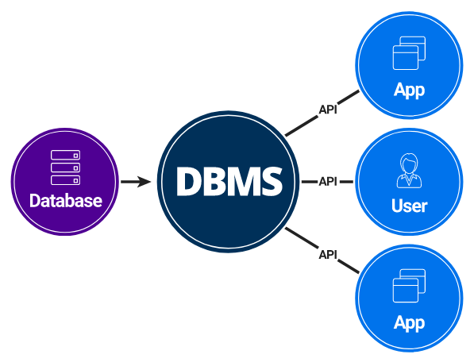

### 📌 **What is Data?**

**Data** is a collection of raw facts and figures that **do not have any meaning on their own**.

It can be **numbers, characters, symbols, images**, or even **audio/video files** — basically **anything** that can be processed by a computer.

---

### ✅ **Simple Example:**

| Name   | Age | City   |
| ------ | --- | ------ |
| Aniket | 22  | Pune   |
| Priya  | 25  | Mumbai |

Each value (like "Aniket", 22, "Pune") is **data**.

---

### 🎯 **In short:**

> Data is unprocessed information that is collected and stored for processing.

---

### 📌 **Related Interview Question:**

**Q: What is the difference between Data and Information?**

| Data             | Information                        |
| ---------------- | ---------------------------------- |
| Raw facts        | Processed data                     |
| No clear meaning | Has meaning                        |
| Example: "85"    | Example: "Student scored 85 marks" |

Here’s a simple explanation of the **Types of Data** with examples and a clean format for interviews:

---

### 📌 **2. Types of Data**

Data is mainly divided into two types:

---

## 🔢 A. Quantitative Data

> Data that can be **measured or counted** (in numbers).

### ✅ i. Numerical Form

* This includes numbers like 10, 45.6, etc.

### ✅ ii. Examples:

* **Weight** of a bag = 5 kg
* **Volume** of water = 2 liters
* **Cost** of an item = ₹500

---

## ✏️ B. Qualitative Data

> Data that is **descriptive**, not expressed in numbers.

### ✅ i. Descriptive, Not Numerical

* Tells **qualities** or **characteristics**.

### ✅ ii. Examples:

* **Name** = Aniket
* **Gender** = Male
* **Hair Color** = Black

---

### 📊 Diagram for Better Understanding:

```
                  TYPES OF DATA
                  ┌──────────────┐
                  │              │
         ┌────────▼──────┐ ┌─────▼─────────┐
         │ Quantitative  │ │ Qualitative   │
         └───────────────┘ └───────────────┘
         │ Numerical form │ │ Descriptive   │
         │ Weight, cost   │ │ Name, gender  │
```

Here’s a simple and clean explanation of **What is Information** — perfect for interviews and understanding:

---

### 📌 **3. What is Information?**

👉 **Information** is **processed, structured, and meaningful data** that helps us make decisions.

---

### ✅ **Key Points:**

a. Information is **organized** and **processed** data.
b. It gives **context** to the data — helps us understand it.
c. It is **useful**, **meaningful**, and ready to be used.
d. It is extracted by **analyzing and interpreting** raw data.

---

### 💡 **Easy Example:**

Let’s say we have data like:

* Names, age, gender of people in your locality → This is **Data**.

Now, if we analyze this data and conclude:

* 👴 There are **100 senior citizens**
* ⚥ The **sex ratio** is **1.1**
* 👶 **100 newborn babies**

👉 These conclusions are called **Information**.

---

### 📊 Simple Diagram:

```
           RAW DATA
               ↓
     Organize + Analyze
               ↓
         → INFORMATION
```

---

### 🟨 **In Short:**

> **Information = Processed Data**
> That helps us **understand something** and **make decisions**.

---

Great! Here's the **difference between Data and Information** in a simple table format — perfect for interview prep:

---

### 📋 **Difference Between Data and Information**

| 🔹 **Data**                           | 🔸 **Information**                      |
| ------------------------------------- | --------------------------------------- |
| Raw, unprocessed facts and figures    | Processed, meaningful form of data      |
| Alone, it doesn't make sense          | Makes sense and is useful               |
| Example: 100, Male, Pune              | Example: 100 senior citizens in Pune    |
| Cannot be used directly for decisions | Helps in decision-making                |
| No context                            | Has context and relevance               |
| Stored in databases                   | Displayed in reports, summaries, charts |

---

### ✅ Quick Summary:

* **Data** is like ingredients.
* **Information** is the cooked dish.

---

Perfect! Here's a **clean and easy-to-understand table** showing all points for **Data vs Information** — great for interviews or notes:

---

### 📋 **4. Data vs Information**

| 🔹 **Data**                                            | 🔸 **Information**                                              |
| ------------------------------------------------------ | --------------------------------------------------------------- |
| a. Collection of raw facts                             | a. Puts those facts into **context**                            |
| b. **Unorganized** and **raw**                         | b. **Organized**, structured, and meaningful                    |
| c. Individual data points may be **unrelated**         | c. Gives a **big-picture view** by connecting those data points |
| d. Data is **meaningless** on its own                  | d. **Meaningful** after analysis and interpretation             |
| e. **Independent** of information                      | e. **Depends on data** to be created                            |
| f. Appears as **numbers, graphs, figures, statistics** | f. Shown through **words, language, summaries, and reports**    |
| g. Not enough for **decision-making**                  | g. Used to make **decisions and conclusions**                   |

---

### 🧠 **Example to Remember Easily:**

* 📊 **Data**:

  * 50, 75, 100
  * "Male", "Female", "20 yrs", "Mumbai"

* 💡 **Information**:

  * "Average age of students is 25"
  * "Gender ratio is 1:1"

---

Here’s a simple and clear explanation for:

---

### 📌 **5. What is a Database?**

👉 A **Database** is an **electronic system** used to **store data** in an organized way so that it can be:

* **Easily accessed**
* **Managed**
* **Updated**

---

### ✅ **Key Points:**

a. A database helps us **store large amounts of data safely**.
b. It allows us to **search, modify, or delete** data whenever needed.
c. Data is usually stored in the form of **tables** (rows and columns).

---

### 💡 **Example:**

Imagine a school stores student information like:

| Student ID | Name   | Age | Class |
| ---------- | ------ | --- | ----- |
| 101        | Aniket | 20  | 12th  |
| 102        | Priya  | 19  | 12th  |

👉 This table is stored inside a **Database**.

---

### 🔧 **Why do we need DBMS?**

> Just storing data is not enough.
> We need a tool/software to **handle and use** that data.

That’s where **DBMS (Database Management System)** comes in.

It helps in:

* Creating databases
* Adding, updating, and deleting data
* Searching data
* Keeping data safe

---

### 🧠 **In Simple Words:**

> A **Database** stores the data.
> A **DBMS** helps you **work with** that data.

---

Here’s a simple explanation for:

---

### 📌 **6. What is DBMS? (Database Management System)**

👉 A **DBMS** is software that helps us to **create**, **store**, **manage**, and **work with data** in a database.

---

### ✅ **Key Points:**

a. A **DBMS** is a **collection of programs** + **database** that helps you:

* **Store** data
* **Access** data
* **Update** data
* **Delete** data
* **Organize** data efficiently

b. It provides a way to interact with the database **easily** and **efficiently**.

---

### 💡 **Real-Life Example:**

Let’s say a college stores student records. Using a DBMS like **MySQL**, **Oracle**, or **MongoDB**, they can:

* Add new student data
* Search students by name or ID
* Update marks or class
* Delete records of passed-out students

---

### 🛠️ **What DBMS Includes:**

| Component         | Function                                   |
| ----------------- | ------------------------------------------ |
| Database          | Stores the actual data                     |
| Software Programs | Used to access and manage the data         |
| Query Language    | Example: SQL, to ask questions to database |

---

### 🎯 **Main Goal of DBMS:**

> To **make storing and accessing data easy, fast, and safe** for users and applications.

---

Perfect! Here's a clear and simple explanation of the:

---

### 📌 **Advantages of DBMS (Database Management System)**

---

| ✅ **Advantage**                | 📄 **Explanation**                                                                  |
| ------------------------------ | ----------------------------------------------------------------------------------- |
| 1. **Data Redundancy Reduced** | Same data is not repeated at multiple places.                                       |
| 2. **Data Consistency**        | If data is updated in one place, it updates everywhere automatically.               |
| 3. **Data Sharing**            | Multiple users can access the same data at the same time.                           |
| 4. **Data Security**           | Access to data can be restricted using usernames, passwords, and roles.             |
| 5. **Data Backup & Recovery**  | DBMS provides automatic tools for backup and recovery of data.                      |
| 6. **Easy Data Access**        | Data can be searched and accessed quickly using queries (e.g., SQL).                |
| 7. **Data Integrity**          | Ensures only correct and valid data is stored (e.g., age cannot be negative).       |
| 8. **Efficient Storage**       | Stores large data efficiently using optimized storage techniques.                   |
| 9. **Multiple Views**          | Different users can see different views of the same database (e.g., admin vs user). |

---

### 🎯 In Simple Words:

> DBMS makes your data more **organized**, **secure**, and **easy to use** — while reducing mistakes and saving time.

---

Great! Let’s break down the **DBMS diagram** you provided and explain it in simple terms:

---

### 📊 **DBMS Architecture Explanation (Based on Diagram)**


---

### 🔄 **Flow of Data:**

1. **📦 Database** (Purple Circle):

   * This is where all the actual **data is stored** (like tables of students, employees, products, etc.).
   * It is just the storage area – not directly used by users or apps.

2. **🌀 DBMS** (Middle Circle):

   * This is the **Database Management System**.
   * It acts like a **bridge** between the database and the external world.
   * It **controls access**, manages the data, and provides tools to store, fetch, update, or delete data.

3. **🔗 API Connections**:

   * **API** stands for **Application Programming Interface**.
   * It’s like a set of rules that allow external systems to **communicate with the DBMS** securely.

4. **👤 User and 🧩 Apps (Blue Circles)**:

   * Users (like admins, analysts, etc.) and apps (like websites, mobile apps, etc.) **connect to the DBMS via API** to use or manage data.
   * They never access the database directly — they always go **through the DBMS**.

---

### 🧠 **Simple Summary:**

> The **DBMS is the manager** that:
>
> * Talks to the database,
> * Handles data requests from apps or users, and
> * Makes sure everything is secure and efficient.

---



### 📋 **8. DBMS vs. File Processing Systems**

Below is a simple comparison showing the **problems with traditional file systems** (on the left) and how a **DBMS solves** them (on the right).

| 🔹 **File-Processing Systems (Disadvantages)** | 🔸 **DBMS (Advantages / “Why to Use DBMS”)**                                 |
| ---------------------------------------------- | ---------------------------------------------------------------------------- |
| 1. **Data Redundancy & Inconsistency**         | 1. **Redundancy Control** – Eliminates duplicate data entries.               |
| 2. **Difficulty in Accessing Data**            | 2. **Easy Data Access** – Query languages (e.g. SQL) simplify retrieval.     |
| 3. **Data Isolation**                          | 3. **Integrated View** – All data managed centrally.                         |
| 4. **Integrity Problems**                      | 4. **Data Integrity** – Enforces rules (e.g. valid age, non-null).           |
| 5. **Atomicity Problems**                      | 5. **Atomic Transactions** – “All-or-nothing” operations ensure consistency. |
| 6. **Concurrent-Access Anomalies**             | 6. **Concurrency Control** – Multiple users can work without clashes.        |
| 7. **Security Problems**                       | 7. **Robust Security** – User authentication, roles, permissions.            |

---

#### 🔍 **Quick Rundown:**

* **File Systems** store data in separate files → leads to duplication, hard-to-maintain code, and errors.
* **DBMS** centralizes data storage and provides tools to manage redundancy, integrity, security, and concurrent access.

---

