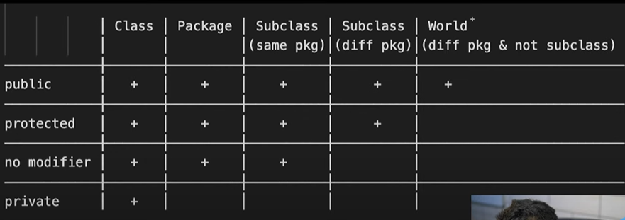

Perfect timing 😃 Let’s go through **Access Modifiers in Java** in **simple language + table + examples**.

---

# 🔑 What are Access Modifiers?

Access modifiers define **who can access a class, method, or variable** in Java.
They control **visibility (scope)**.

Java has **4 main access modifiers**:

---

## 1️⃣ `public`

* Accessible from **anywhere** (same class, same package, different package).
* Most open.

```java
public class Car {
    public String name = "BMW";
    public void showName() {
        System.out.println(name);
    }
}
```

✅ Anyone can access `Car.name` and `Car.showName()`.

---

## 2️⃣ `protected`

* Accessible:

  * Inside the **same class**
  * Inside the **same package**
  * In **child classes (subclasses)** (even if they are in another package)

```java
class Vehicle {
    protected int speed = 60;
}

class Car extends Vehicle {
    void showSpeed() {
        System.out.println("Speed: " + speed); // ✅ accessible
    }
}
```

---

## 3️⃣ (default) → **no keyword**

* If you don’t write any modifier, it is **package-private**.
* Accessible **only within the same package**.
* Not visible outside package.

```java
class Bike {
    int wheels = 2; // default
}
```

If another class in the **same package** uses `wheels`, it’s fine.
But in another package → ❌ not allowed.

---

## 4️⃣ `private`

* Accessible **only inside the same class**.
* Most restricted.

```java
class BankAccount {
    private int balance = 1000;

    private void showBalance() {
        System.out.println("Balance: " + balance);
    }
}
```

`balance` and `showBalance()` cannot be accessed outside the `BankAccount` class.

---

# 📊 Summary Table

| Modifier      | Same Class | Same Package | Subclass (other package) | Other Package |
| ------------- | ---------- | ------------ | ------------------------ | ------------- |
| **public**    | ✅ Yes      | ✅ Yes        | ✅ Yes                    | ✅ Yes         |
| **protected** | ✅ Yes      | ✅ Yes        | ✅ Yes                    | ❌ No          |
| **default**   | ✅ Yes      | ✅ Yes        | ❌ No                     | ❌ No          |
| **private**   | ✅ Yes      | ❌ No         | ❌ No                     | ❌ No          |

---

# 🚗 Real Life Example

* `public` → A **car’s brand name** (everyone knows).
* `protected` → **engine details** (only mechanics and company know).
* `default` → **local showroom data** (only people in that city/package).
* `private` → **ATM PIN** (only you know).

---

Got it 👍 Let’s go **one by one** in **very simple detail** with **examples**.

---

# 1️⃣ **`public` Access Modifier**

👉 **Meaning**: `public` members can be accessed **from anywhere**:

* same class
* same package
* different package
* subclass

It is the **most open** access level.

### ✅ Example

```java
// File: Vehicle.java
package transport;

public class Vehicle {
    public String name = "Car";

    public void showName() {
        System.out.println("Vehicle: " + name);
    }
}
```

```java
// File: Main.java
package test;

import transport.Vehicle;  // ✅ can import because it's public

public class Main {
    public static void main(String[] args) {
        Vehicle v = new Vehicle();
        v.showName(); // ✅ works anywhere
        System.out.println(v.name); // ✅ accessible
    }
}
```

👉 **Output**

```
Vehicle: Car
Car
```

**Real-life analogy**:

* `public` = A car’s **brand name** (BMW, Audi) → everyone can see it.

---

# 2️⃣ **`protected` Access Modifier**

👉 **Meaning**:

* Accessible in:

  * same class
  * same package
  * subclass (child class), even if in another package
* ❌ Not accessible in **non-subclasses** of other packages.

### ✅ Example

```java
// File: Vehicle.java
package transport;

public class Vehicle {
    protected int speed = 80;

    protected void showSpeed() {
        System.out.println("Speed: " + speed);
    }
}
```

```java
// File: Car.java
package transport;

public class Car extends Vehicle {
    void display() {
        showSpeed();  // ✅ accessible in same package
    }
}
```

```java
// File: Bike.java
package test;

import transport.Vehicle;

class Bike extends Vehicle {
    void display() {
        showSpeed();  // ✅ accessible because Bike is a subclass
    }
}

public class Main {
    public static void main(String[] args) {
        Vehicle v = new Vehicle();
        // v.showSpeed(); ❌ ERROR (not subclass here)
    }
}
```

**Real-life analogy**:

* `protected` = A car’s **engine design**. Only company mechanics (child classes) can see it, not general public.

---

# 3️⃣ **default (no modifier)**

👉 **Meaning**:

* If you don’t write anything, it is **package-private**.
* Accessible **only within the same package**.
* ❌ Not accessible from other packages.

### ✅ Example

```java
// File: Vehicle.java
package transport;

class Vehicle {   // default class
    int wheels = 4; // default variable

    void showWheels() {  // default method
        System.out.println("Wheels: " + wheels);
    }
}
```

```java
// File: Main.java
package transport;

public class Main {
    public static void main(String[] args) {
        Vehicle v = new Vehicle(); // ✅ same package
        v.showWheels(); // ✅ accessible
    }
}
```

```java
// File: TestMain.java
package test;

import transport.Vehicle;

public class TestMain {
    public static void main(String[] args) {
        // Vehicle v = new Vehicle(); ❌ ERROR (not visible outside package)
    }
}
```

**Real-life analogy**:

* `default` = A **local showroom discount** → only people in that city (same package) can use it.

---

# 4️⃣ **`private` Access Modifier**

👉 **Meaning**:

* Accessible **only inside the same class**.
* ❌ Not accessible in same package, subclasses, or other packages.

### ✅ Example

```java
class BankAccount {
    private int balance = 1000;

    private void showBalance() {
        System.out.println("Balance: " + balance);
    }

    public void accessBalance() {
        showBalance(); // ✅ private method accessible inside same class
    }
}

public class Main {
    public static void main(String[] args) {
        BankAccount acc = new BankAccount();
        // System.out.println(acc.balance); ❌ ERROR
        acc.accessBalance(); // ✅ accessible through public method
    }
}
```

👉 **Output**

```
Balance: 1000
```

**Real-life analogy**:

* `private` = Your **ATM PIN** → only you (the same class) can use it.

---

✅ So now you know:

* `public` → accessible everywhere
* `protected` → same package + child classes in other packages
* `default` → only same package
* `private` → only same class

---

