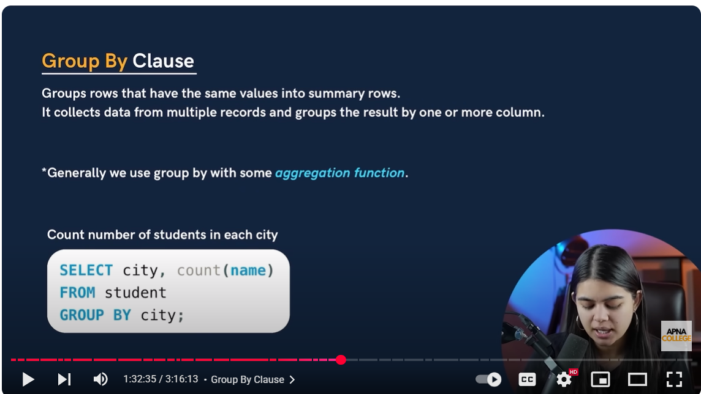

Perfect! Let’s dive into the **`GROUP BY` clause in SQL** with **simple explanations, examples, real-life use cases, and interview tips**.

---

# SQL GROUP BY Clause

The **`GROUP BY` clause** is used to **group rows that have the same values in specified columns** into **summary rows**, often combined with **aggregate functions** like `COUNT()`, `SUM()`, `AVG()`, `MAX()`, `MIN()`.

---

## 1. **Basic Syntax**

```sql
SELECT column1, AGGREGATE_FUNCTION(column2)
FROM table_name
GROUP BY column1;
```

* `column1` → the column by which you want to group rows
* `AGGREGATE_FUNCTION(column2)` → performs calculation on each group

---

## 2. **Example – Employee Table**

Assume the following **Employee table with 10 rows**:

| EmpID | Name         | Department | Salary |
| ----- | ------------ | ---------- | ------ |
| 1     | Amit Sharma  | IT         | 55000  |
| 2     | Riya Singh   | HR         | 48000  |
| 3     | Vikram Patel | IT         | 60000  |
| 4     | Sana Khan    | NULL       | 45000  |
| 5     | Karan Mehta  | Finance    | 70000  |
| 6     | Anita Roy    | HR         | 52000  |
| 7     | Rahul Verma  | IT         | 53000  |
| 8     | Priya Sharma | Finance    | 65000  |
| 9     | Neha Gupta   | HR         | 47000  |
| 10    | Aditya Singh | IT         | 58000  |

---

## 3. **Example 1 – Count Employees per Department**

```sql
SELECT Department, COUNT(EmpID) AS EmployeeCount
FROM Employee
WHERE Department IS NOT NULL
GROUP BY Department;
```

**Result:**

| Department | EmployeeCount |
| ---------- | ------------- |
| IT         | 4             |
| HR         | 3             |
| Finance    | 2             |

**Explanation:**

* Groups employees by department
* Counts employees in each department
* Excludes NULL departments

---

## 4. **Example 2 – Average Salary per Department**

```sql
SELECT Department, AVG(Salary) AS AvgSalary
FROM Employee
WHERE Department IS NOT NULL
GROUP BY Department;
```

**Result:**

| Department | AvgSalary |
| ---------- | --------- |
| IT         | 55500     |
| HR         | 49000     |
| Finance    | 67500     |

**Explanation:**

* `AVG(Salary)` calculates average salary **per department**

---

## 5. **Example 3 – Multiple Aggregate Functions**

```sql
SELECT Department,
       COUNT(EmpID) AS EmployeeCount,
       AVG(Salary) AS AvgSalary,
       MAX(Salary) AS MaxSalary,
       MIN(Salary) AS MinSalary
FROM Employee
WHERE Department IS NOT NULL
GROUP BY Department;
```

**Result:**

| Department | EmployeeCount | AvgSalary | MaxSalary | MinSalary |
| ---------- | ------------- | --------- | --------- | --------- |
| IT         | 4             | 55500     | 60000     | 53000     |
| HR         | 3             | 49000     | 52000     | 47000     |
| Finance    | 2             | 67500     | 70000     | 65000     |

**Explanation:**

* You can **combine multiple aggregate functions** for each group

---

## 6. **GROUP BY with HAVING**

**Goal:** Only show departments where **average salary > 50000**:

```sql
SELECT Department, AVG(Salary) AS AvgSalary
FROM Employee
WHERE Department IS NOT NULL
GROUP BY Department
HAVING AVG(Salary) > 50000;
```

**Result:**

| Department | AvgSalary |
| ---------- | --------- |
| IT         | 55500     |
| Finance    | 67500     |

**Explanation:**

* `HAVING` filters **after aggregation**
* Unlike `WHERE`, which filters **before grouping**

---

## 7. **Real-life Use Cases**

1. **HR Reports:** Count employees per department, average salary per department
2. **Sales Data:** Total sales per region or per product
3. **Analytics:** Group users by age, city, or subscription plan

---

### ✅ Interview Tips

1. `GROUP BY` is always used with **aggregate functions**
2. Can combine with **HAVING** for filtering groups
3. Works with **ORDER BY** to sort grouped results
4. Common question:

   * Difference between `WHERE` and `HAVING`
   * Example: “Why can’t we use `AVG()` in `WHERE`?” → Aggregates work **after rows are grouped**, so `HAVING` is required

---

Perfect! Let’s create **one complete, placement-ready query example** using **`GROUP BY`**, **aggregate functions**, **HAVING**, **ORDER BY**, and **LIMIT** together with **10 rows of Employee table**. I’ll explain everything step by step.

---

# SQL GROUP BY – Full Example

## 1. Employee Table (10 Rows)

```sql
CREATE TABLE Employee (
    EmpID INT PRIMARY KEY,
    Name VARCHAR(50),
    Department VARCHAR(50),
    Salary DECIMAL(10,2),
    JoiningDate DATE
);

INSERT INTO Employee (EmpID, Name, Department, Salary, JoiningDate)
VALUES 
(1, 'Amit Sharma', 'IT', 55000, '2023-06-15'),
(2, 'Riya Singh', 'HR', 48000, '2022-11-20'),
(3, 'Vikram Patel', 'IT', 60000, '2021-09-10'),
(4, 'Sana Khan', NULL, 45000, '2024-01-05'),
(5, 'Karan Mehta', 'Finance', 70000, '2020-03-12'),
(6, 'Anita Roy', 'HR', 52000, '2023-02-18'),
(7, 'Rahul Verma', 'IT', 53000, '2022-05-30'),
(8, 'Priya Sharma', 'Finance', 65000, '2021-12-11'),
(9, 'Neha Gupta', 'HR', 47000, '2023-08-01'),
(10, 'Aditya Singh', 'IT', 58000, '2022-10-22');
```

---

## 2. Combined GROUP BY Query

**Goal:**

* Group employees by **Department**
* Show **total employees, average salary, max & min salary**
* Only include departments where **average salary > 50000**
* Sort by **average salary descending**
* Return **top 2 departments only**

```sql
SELECT 
    Department,
    COUNT(EmpID) AS EmployeeCount,
    AVG(Salary) AS AvgSalary,
    MAX(Salary) AS MaxSalary,
    MIN(Salary) AS MinSalary
FROM Employee
WHERE Department IS NOT NULL
GROUP BY Department
HAVING AVG(Salary) > 50000
ORDER BY AvgSalary DESC
LIMIT 2;
```

---

## 3. Step-by-Step Explanation

1. **`WHERE Department IS NOT NULL`**

   * Excludes employees without a department (like Sana Khan).

2. **`GROUP BY Department`**

   * Groups employees by their department (`IT`, `HR`, `Finance`).

3. **Aggregate Functions:**

   * `COUNT(EmpID)` → number of employees per department
   * `AVG(Salary)` → average salary per department
   * `MAX(Salary)` → highest salary per department
   * `MIN(Salary)` → lowest salary per department

4. **`HAVING AVG(Salary) > 50000`**

   * Filters groups with average salary **greater than 50000**
   * `WHERE` cannot filter aggregated values, so `HAVING` is used

5. **`ORDER BY AvgSalary DESC`**

   * Sorts grouped results by average salary descending

6. **`LIMIT 2`**

   * Returns **top 2 departments only**

---

## 4. Expected Result

| Department | EmployeeCount | AvgSalary | MaxSalary | MinSalary |
| ---------- | ------------- | --------- | --------- | --------- |
| Finance    | 2             | 67500     | 70000     | 65000     |
| IT         | 4             | 55500     | 60000     | 53000     |

**Explanation:**

* Finance → 2 employees, average 67500
* IT → 4 employees, average 55500
* HR is excluded because its average salary is 49000 (< 50000)

---

## 5. Real-life Use Case

* HR wants a **department-wise summary report**:

  * Number of employees
  * Average salary
  * Salary range (max/min)
* Can combine with **LIMIT** to display **top N departments** on dashboard

---

### ✅ Interview Tips

1. `GROUP BY` is always used with **aggregate functions**
2. Use `HAVING` to filter **after aggregation**
3. Can combine with `ORDER BY` and `LIMIT` for **top-N analysis**
4. Often asked in **placement interviews** with slight variations

---

