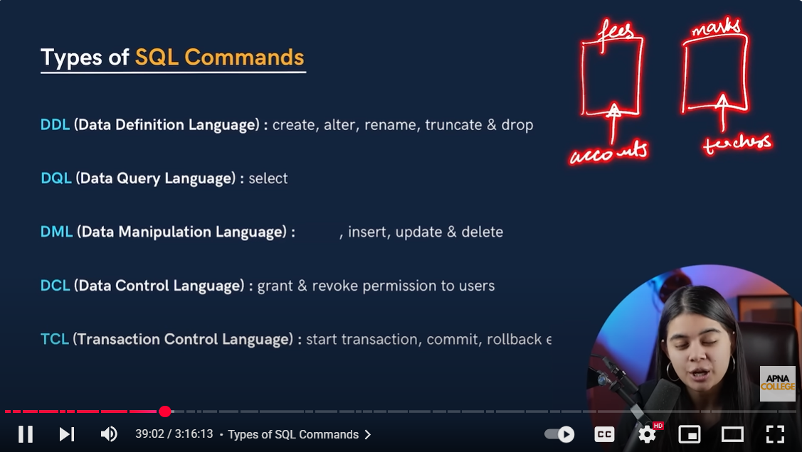

---



---

Perfect! Let’s dive into the **`LIMIT` clause in SQL** with **simple explanation, queries, and real-life examples**. This is very useful for **placement interviews**.

---

# SQL LIMIT Clause

The **`LIMIT` clause** is used to **restrict the number of rows returned by a query**.

* Supported in **MySQL, PostgreSQL, SQLite**.
* In **SQL Server**, the equivalent is `TOP n`.

---

## 1. **Basic Syntax**

```sql
SELECT column1, column2
FROM table_name
LIMIT number_of_rows;
```

**Example:**

```sql
-- Select first 3 employees
SELECT Name, Department, Salary
FROM Employee
LIMIT 3;
```

---

## 2. **LIMIT with OFFSET**

* **OFFSET** allows you to **skip a number of rows** before returning results.

```sql
-- Skip first 2 rows, return next 3 rows
SELECT Name, Department, Salary
FROM Employee
LIMIT 3 OFFSET 2;
```

**Explanation:**

* Skips the first 2 rows.
* Returns the next 3 rows only.

> Shortcut in MySQL: `LIMIT offset, count`

```sql
-- Same as above
SELECT Name, Department, Salary
FROM Employee
LIMIT 2, 3;
```

---

## 3. **Order with LIMIT**

* Often combined with `ORDER BY` to get **top N results**.

```sql
-- Get top 2 highest paid employees
SELECT Name, Salary
FROM Employee
ORDER BY Salary DESC
LIMIT 2;
```

**Real-life Example:**

* HR wants to see **top 2 highest-paid employees**.
* Pagination in web apps: `LIMIT` used to fetch **first 10 rows per page**.

---

## 4. **Combined Example**

```sql
-- Get 2 IT employees with salary above 50000
SELECT Name, Department, Salary
FROM Employee
WHERE Department = 'IT'
  AND Salary > 50000
ORDER BY Salary DESC
LIMIT 2;
```

**Explanation:**

* Filters by department and salary
* Orders by salary descending
* Returns **only top 2 employees**

---

### ✅ Interview Tips

* `LIMIT` is **used for top N queries or pagination**.
* In SQL Server, use `TOP n` instead:

```sql
SELECT TOP 3 Name, Salary
FROM Employee
ORDER BY Salary DESC;
```

* Can be combined with `ORDER BY`, `WHERE`, and joins for **complex queries**.

---

Perfect! Let’s create a **complete practical example** using **10 rows in the Employee table**, and show **how the `LIMIT` clause works in various scenarios**. I’ll explain each step clearly so it’s **interview-ready**.

---

# SQL LIMIT Clause – Full Example with 10 Rows

## 1. Create Employee Table and Insert 10 Rows

```sql
CREATE TABLE Employee (
    EmpID INT PRIMARY KEY,
    Name VARCHAR(50),
    Department VARCHAR(50),
    Salary DECIMAL(10,2),
    JoiningDate DATE
);

-- Insert 10 sample employees
INSERT INTO Employee (EmpID, Name, Department, Salary, JoiningDate)
VALUES 
(1, 'Amit Sharma', 'IT', 55000, '2023-06-15'),
(2, 'Riya Singh', 'HR', 48000, '2022-11-20'),
(3, 'Vikram Patel', 'IT', 60000, '2021-09-10'),
(4, 'Sana Khan', NULL, 45000, '2024-01-05'),
(5, 'Karan Mehta', 'Finance', 70000, '2020-03-12'),
(6, 'Anita Roy', 'HR', 52000, '2023-02-18'),
(7, 'Rahul Verma', 'IT', 53000, '2022-05-30'),
(8, 'Priya Sharma', 'Finance', 65000, '2021-12-11'),
(9, 'Neha Gupta', 'HR', 47000, '2023-08-01'),
(10, 'Aditya Singh', 'IT', 58000, '2022-10-22');
```

---

## 2. Basic LIMIT Example

**Goal:** Get the **first 5 employees** from the table.

```sql
SELECT EmpID, Name, Department, Salary
FROM Employee
LIMIT 5;
```

**Result:**

| EmpID | Name         | Department | Salary |
| ----- | ------------ | ---------- | ------ |
| 1     | Amit Sharma  | IT         | 55000  |
| 2     | Riya Singh   | HR         | 48000  |
| 3     | Vikram Patel | IT         | 60000  |
| 4     | Sana Khan    | NULL       | 45000  |
| 5     | Karan Mehta  | Finance    | 70000  |

**Explanation:**

* Only the **first 5 rows** are returned.
* Useful for **previewing data**.

---

## 3. LIMIT with OFFSET

**Goal:** Skip first 5 employees, get the **next 3**.

```sql
SELECT EmpID, Name, Department, Salary
FROM Employee
LIMIT 3 OFFSET 5;
```

**Result:**

| EmpID | Name         | Department | Salary |
| ----- | ------------ | ---------- | ------ |
| 6     | Anita Roy    | HR         | 52000  |
| 7     | Rahul Verma  | IT         | 53000  |
| 8     | Priya Sharma | Finance    | 65000  |

**Explanation:**

* Skips first 5 rows.
* Returns **rows 6, 7, 8**.
* Used for **pagination** in web apps.

---

## 4. LIMIT with ORDER BY

**Goal:** Get **top 3 highest-paid employees**.

```sql
SELECT Name, Department, Salary
FROM Employee
ORDER BY Salary DESC
LIMIT 3;
```

**Result:**

| Name         | Department | Salary |
| ------------ | ---------- | ------ |
| Karan Mehta  | Finance    | 70000  |
| Priya Sharma | Finance    | 65000  |
| Vikram Patel | IT         | 60000  |

**Explanation:**

* `ORDER BY Salary DESC` → sort salaries from highest to lowest
* `LIMIT 3` → get **top 3 earners**

---

## 5. LIMIT with WHERE + ORDER BY

**Goal:** Get **top 2 IT employees earning more than 53000**.

```sql
SELECT Name, Department, Salary
FROM Employee
WHERE Department = 'IT'
  AND Salary > 53000
ORDER BY Salary DESC
LIMIT 2;
```

**Result:**

| Name         | Department | Salary |
| ------------ | ---------- | ------ |
| Vikram Patel | IT         | 60000  |
| Aditya Singh | IT         | 58000  |

**Explanation:**

* Filters IT department and salary > 53000
* Sorted descending by salary
* Returns **top 2 rows only**

**Real-life use:**

* HR wants a **shortlist of highest-paid IT employees** for a bonus.

---

### ✅ Summary Table – LIMIT Clause Use Cases

| Use Case                  | SQL Query Example                                               | Result             |
| ------------------------- | --------------------------------------------------------------- | ------------------ |
| First N rows              | `LIMIT 5`                                                       | First 5 employees  |
| Skip & return next N rows | `LIMIT 3 OFFSET 5`                                              | Employees 6–8      |
| Top N by column           | `ORDER BY Salary DESC LIMIT 3`                                  | Highest-paid 3     |
| Filter + Top N            | `WHERE Dept='IT' AND Salary>53000 ORDER BY Salary DESC LIMIT 2` | Top 2 IT employees |

---

**Interview Tips:**

1. `LIMIT` is often combined with **`ORDER BY`** for top-N queries.
2. Useful for **pagination**: return data page by page.
3. MySQL/PostgreSQL: `LIMIT n` / `LIMIT offset, n`
4. SQL Server alternative: `SELECT TOP n ... ORDER BY ...`

---

