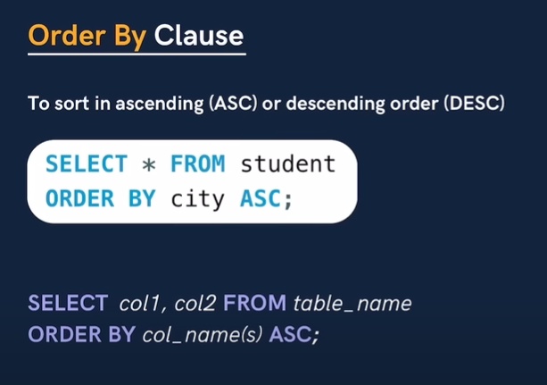

---

# SQL ORDER BY Clause

The **`ORDER BY` clause** is used to **sort the result set** of a query in **ascending (ASC)** or **descending (DESC)** order.

* By default, **ASC (ascending)** is used.
* Can sort by **one or multiple columns**.
* Often combined with **LIMIT, WHERE, GROUP BY**.

---

## 1. **Basic Syntax**

```sql
SELECT column1, column2
FROM table_name
ORDER BY column1 ASC;   -- ascending (default)
```

```sql
SELECT column1, column2
FROM table_name
ORDER BY column1 DESC;  -- descending
```

---

## 2. **Example – Single Column**

**Goal:** List employees **sorted by Salary ascending**.

```sql
SELECT Name, Department, Salary
FROM Employee
ORDER BY Salary ASC;
```

**Result Example:**

| Name         | Department | Salary |
| ------------ | ---------- | ------ |
| Sana Khan    | NULL       | 45000  |
| Riya Singh   | HR         | 48000  |
| Neha Gupta   | HR         | 47000  |
| Anita Roy    | HR         | 52000  |
| Rahul Verma  | IT         | 53000  |
| Amit Sharma  | IT         | 55000  |
| Aditya Singh | IT         | 58000  |
| Vikram Patel | IT         | 60000  |
| Priya Sharma | Finance    | 65000  |
| Karan Mehta  | Finance    | 70000  |

---

## 3. **Example – Descending Order**

**Goal:** List employees **sorted by Salary descending**.

```sql
SELECT Name, Department, Salary
FROM Employee
ORDER BY Salary DESC;
```

**Result Example:**

| Name         | Department | Salary |
| ------------ | ---------- | ------ |
| Karan Mehta  | Finance    | 70000  |
| Priya Sharma | Finance    | 65000  |
| Vikram Patel | IT         | 60000  |
| Aditya Singh | IT         | 58000  |
| Amit Sharma  | IT         | 55000  |
| Rahul Verma  | IT         | 53000  |
| Anita Roy    | HR         | 52000  |
| Riya Singh   | HR         | 48000  |
| Neha Gupta   | HR         | 47000  |
| Sana Khan    | NULL       | 45000  |

---

## 4. **Order By Multiple Columns**

**Goal:** Sort employees **by Department ascending** and **Salary descending**.

```sql
SELECT Name, Department, Salary
FROM Employee
ORDER BY Department ASC, Salary DESC;
```

**Result Example:**

| Name         | Department | Salary |
| ------------ | ---------- | ------ |
| Priya Sharma | Finance    | 65000  |
| Karan Mehta  | Finance    | 70000  |
| Vikram Patel | IT         | 60000  |
| Aditya Singh | IT         | 58000  |
| Amit Sharma  | IT         | 55000  |
| Rahul Verma  | IT         | 53000  |
| Anita Roy    | HR         | 52000  |
| Riya Singh   | HR         | 48000  |
| Neha Gupta   | HR         | 47000  |
| Sana Khan    | NULL       | 45000  |

**Explanation:**

* **First** sorted by `Department ASC` (Finance, HR, IT, NULL)
* **Within department**, sorted by `Salary DESC`

---

## 5. **Order By with LIMIT**

**Goal:** Get **top 3 highest-paid employees**.

```sql
SELECT Name, Salary
FROM Employee
ORDER BY Salary DESC
LIMIT 3;
```

**Result Example:**

| Name         | Salary |
| ------------ | ------ |
| Karan Mehta  | 70000  |
| Priya Sharma | 65000  |
| Vikram Patel | 60000  |

**Real-life use:**

* HR wants a **top salary report**
* Pagination in dashboards: sort data first, then fetch top N

---

## 6. **Interview Points**

1. Default sort is **ASC** if not specified.
2. Multiple columns can be sorted with **comma-separated list**.
3. Works well with **LIMIT** for top-N queries.
4. Often asked in combination with **GROUP BY** or **JOINs**.

---

