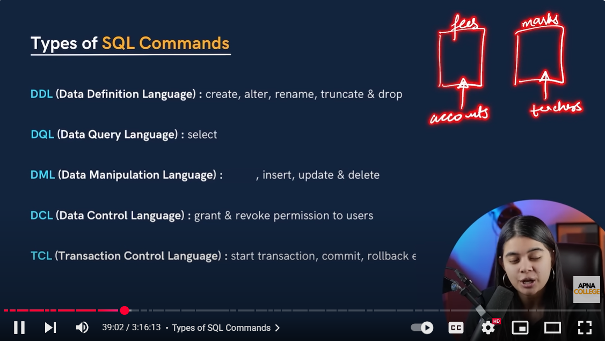
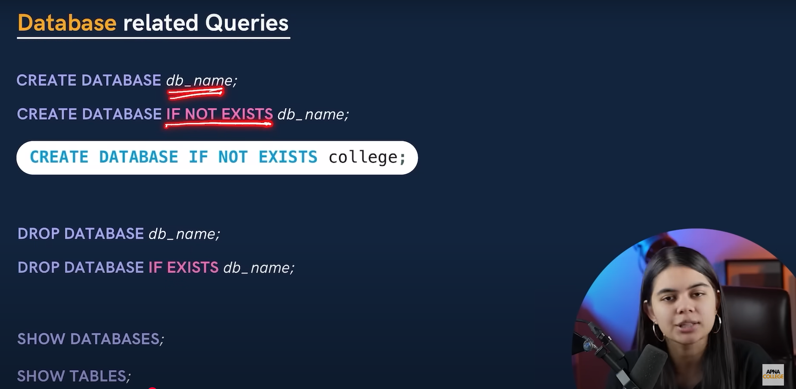
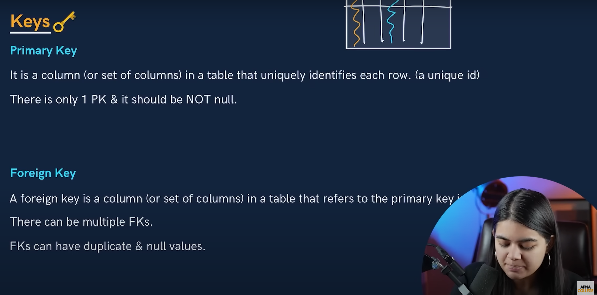

Perfect! Let’s move to **Types of SQL Commands**. I’ll explain everything in **simple language**, with **real-life examples** and queries so you can add it to your `README.md`.

---

# Types of SQL Commands

SQL commands are instructions used to **interact with a database**. They are broadly classified into **five main categories**:

1. **DDL (Data Definition Language)**
2. **DML (Data Manipulation Language)**
3. **DCL (Data Control Language)**
4. **TCL (Transaction Control Language)**
5. **DQL (Data Query Language)**

---

## 1. **DDL - Data Definition Language**

**Purpose:** Define or modify the structure of database objects like tables, schemas, indexes, etc.

**Common Commands:**

* `CREATE` → Create a new table, database, or object
* `ALTER` → Modify structure of existing table
* `DROP` → Delete a table, database, or object
* `TRUNCATE` → Remove all records from a table (faster than DELETE)

**Example Queries:**

```sql
-- Create a table
CREATE TABLE Employee (
    EmpID INT,
    Name VARCHAR(50),
    Salary DECIMAL(10,2)
);

-- Alter table to add a column
ALTER TABLE Employee ADD Department VARCHAR(50);

-- Delete a table
DROP TABLE Employee;

-- Remove all data from table
TRUNCATE TABLE Employee;
```

**Real-life Example:**

* Creating an `Employee` table for a company database.
* Adding a `Department` column later if the company grows.

---

## 2. **DML - Data Manipulation Language**

**Purpose:** Work with the **data inside tables** (insert, update, delete).

**Common Commands:**

* `INSERT` → Add new records
* `UPDATE` → Modify existing records
* `DELETE` → Remove records

**Example Queries:**

```sql
-- Insert records
INSERT INTO Employee (EmpID, Name, Salary, Department)
VALUES (1, 'Amit Sharma', 50000, 'IT');

-- Update salary
UPDATE Employee
SET Salary = 55000
WHERE EmpID = 1;

-- Delete a record
DELETE FROM Employee
WHERE EmpID = 1;
```

**Real-life Example:**

* Adding new employees, updating their salary, or removing them when they leave.

---

## 3. **DCL - Data Control Language**

**Purpose:** Control **access and permissions** in the database.

**Common Commands:**

* `GRANT` → Give privileges to a user
* `REVOKE` → Remove privileges

**Example Queries:**

```sql
-- Grant SELECT permission to user
GRANT SELECT ON Employee TO 'user1';

-- Revoke permission
REVOKE SELECT ON Employee FROM 'user1';
```

**Real-life Example:**

* Giving a junior employee permission to view data but not delete it.

---

## 4. **TCL - Transaction Control Language**

**Purpose:** Manage **transactions**, i.e., group of operations that must be executed together.

**Common Commands:**

* `COMMIT` → Save all changes permanently
* `ROLLBACK` → Undo changes
* `SAVEPOINT` → Set a point to rollback to

**Example Queries:**

```sql
-- Start a transaction
BEGIN;

UPDATE Employee SET Salary = 60000 WHERE EmpID = 1;

-- Savepoint
SAVEPOINT BeforeBonus;

UPDATE Employee SET Salary = 65000 WHERE EmpID = 1;

-- Undo last update
ROLLBACK TO BeforeBonus;

-- Commit changes
COMMIT;
```

**Real-life Example:**

* Updating salary and bonus for employees. If mistake happens, rollback to savepoint.

---

## 5. **DQL - Data Query Language**

**Purpose:** Retrieve data from database tables.

**Common Command:**

* `SELECT` → Fetch data from one or more tables

**Example Queries:**

```sql
-- Select all columns
SELECT * FROM Employee;

-- Select specific columns
SELECT Name, Salary FROM Employee;

-- Filter data
SELECT * FROM Employee WHERE Salary > 50000;
```

**Real-life Example:**

* Fetch all employees with salary above 50,000 for reporting.

---

### ✅ Summary Table for Placement

| Category | Commands                      | Purpose                 | Real-life Example                            |
| -------- | ----------------------------- | ----------------------- | -------------------------------------------- |
| DDL      | CREATE, ALTER, DROP, TRUNCATE | Define/modify structure | Create Employee table, add Department column |
| DML      | INSERT, UPDATE, DELETE        | Manipulate data         | Add new employee, update salary              |
| DCL      | GRANT, REVOKE                 | Control permissions     | Allow junior staff to view data              |
| TCL      | COMMIT, ROLLBACK, SAVEPOINT   | Manage transactions     | Update salary and bonus safely               |
| DQL      | SELECT                        | Query data              | Fetch employees with salary > 50,000         |

---

Absolutely, Aniket! Let’s go **deep into each type of SQL command** with **interview-focused explanations**, practical examples, and **why recruiters ask them**. I’ll structure it so you can **directly use it in README.md or for revision**.

---

# Types of SQL Commands – Detailed Explanation for Placements

SQL commands are divided into **5 main categories**, each serving a specific purpose. Understanding them is crucial for interviews because recruiters often ask:

* “What is the difference between DDL, DML, DCL, TCL, DQL?”
* “Give examples of each command and their use cases.”
* “How do you control transactions in SQL?”

---

## 1. **DDL – Data Definition Language**

**Purpose:** Define or modify the **structure of database objects** like tables, indexes, or schemas.

**Common Commands and Purpose:**

| Command    | Purpose                                          | Example                                               |
| ---------- | ------------------------------------------------ | ----------------------------------------------------- |
| `CREATE`   | Create a new table or database                   | `CREATE TABLE Employee(EmpID INT, Name VARCHAR(50));` |
| `ALTER`    | Modify existing table (add, modify, drop column) | `ALTER TABLE Employee ADD Salary DECIMAL(10,2);`      |
| `DROP`     | Delete table or database permanently             | `DROP TABLE Employee;`                                |
| `TRUNCATE` | Remove all rows, keeps table structure           | `TRUNCATE TABLE Employee;`                            |

**Key Interview Points:**

* DDL **does not manipulate data**, only structure.
* `TRUNCATE` is faster than `DELETE` because it doesn’t log individual row deletions.
* `CREATE` vs `INSERT`: `CREATE` is structural, `INSERT` adds data.

**Real-life Example:**

* When a company starts a new HR system, you **create tables** like Employee, Department, Salary, etc.

---

## 2. **DML – Data Manipulation Language**

**Purpose:** Work with **data inside tables** – adding, modifying, or removing records.

**Commands and Purpose:**

| Command  | Purpose              | Example                                           |
| -------- | -------------------- | ------------------------------------------------- |
| `INSERT` | Add new data         | `INSERT INTO Employee VALUES(1,'Amit',50000);`    |
| `UPDATE` | Modify existing data | `UPDATE Employee SET Salary=55000 WHERE EmpID=1;` |
| `DELETE` | Remove data          | `DELETE FROM Employee WHERE EmpID=1;`             |

**Key Interview Points:**

* Always combine `UPDATE` or `DELETE` with `WHERE` clause to avoid affecting all rows.
* DML **changes data** but **doesn’t change table structure**.
* Recruiters may ask: “Difference between `DELETE` and `TRUNCATE`?”

**Real-life Example:**

* Add new employee data, update salary after appraisal, remove ex-employees.

---

## 3. **DCL – Data Control Language**

**Purpose:** Control **user access and permissions** in the database.

**Commands and Purpose:**

| Command  | Purpose                   | Example                                   |
| -------- | ------------------------- | ----------------------------------------- |
| `GRANT`  | Give privileges to a user | `GRANT SELECT ON Employee TO 'user1';`    |
| `REVOKE` | Remove privileges         | `REVOKE SELECT ON Employee FROM 'user1';` |

**Key Interview Points:**

* DCL ensures **data security**.
* Common interview question: “How would you give read-only access to a junior employee?” → Use `GRANT SELECT`.
* Often used in **multi-user environments** to restrict access.

**Real-life Example:**

* HR manager can view salaries (`GRANT SELECT`), but interns cannot (`REVOKE`).

---

## 4. **TCL – Transaction Control Language**

**Purpose:** Manage **transactions**, i.e., a set of SQL operations executed as a unit.

**Commands and Purpose:**

| Command     | Purpose                      | Example                   |
| ----------- | ---------------------------- | ------------------------- |
| `COMMIT`    | Save all changes permanently | `COMMIT;`                 |
| `ROLLBACK`  | Undo changes                 | `ROLLBACK;`               |
| `SAVEPOINT` | Set a point to rollback to   | `SAVEPOINT BeforeUpdate;` |

**Key Interview Points:**

* **Transactions ensure data consistency** – either all operations succeed, or none.
* Recruiters may ask: “What is a transaction? Explain with example.”
* Example scenario: Update salary and bonus for employees → if bonus fails, rollback salary too.

**Real-life Example:**

* Banking systems: Transfer money from account A to B. If debit succeeds but credit fails, `ROLLBACK` prevents money loss.

---

## 5. **DQL – Data Query Language**

**Purpose:** Retrieve **data from the database**.

**Common Commands:**

| Command  | Purpose                            | Example                                                 |
| -------- | ---------------------------------- | ------------------------------------------------------- |
| `SELECT` | Fetch data from one or more tables | `SELECT Name, Salary FROM Employee WHERE Salary>50000;` |

**Key Interview Points:**

* DQL is **read-only**; it does not modify data.
* Interviewers often combine DQL with **joins, aggregates, group by, having**.
* “Difference between DML and DQL?” → DML changes data; DQL only reads data.

**Real-life Example:**

* Generate reports: “Show employees with salary > 50,000”

---

### ✅ Quick Comparison Table for Placement

| Category | Commands                      | Purpose                       | Example                            | Interview Tip                                       |
| -------- | ----------------------------- | ----------------------------- | ---------------------------------- | --------------------------------------------------- |
| DDL      | CREATE, ALTER, DROP, TRUNCATE | Define/modify table structure | `CREATE TABLE Employee(...)`       | Mention `TRUNCATE` is faster than `DELETE`          |
| DML      | INSERT, UPDATE, DELETE        | Manipulate data               | `INSERT INTO Employee VALUES(...)` | Always use `WHERE` in UPDATE/DELETE                 |
| DCL      | GRANT, REVOKE                 | Control permissions           | `GRANT SELECT ON Employee`         | Useful for access control questions                 |
| TCL      | COMMIT, ROLLBACK, SAVEPOINT   | Manage transactions           | `ROLLBACK TO Savepoint;`           | Explain transactions with banking examples          |
| DQL      | SELECT                        | Retrieve data                 | `SELECT * FROM Employee`           | Combine with joins, group by, aggregate for queries |

---

Perfect! Let’s create **one practical example** that demonstrates **DDL, DML, DCL, TCL, and DQL together** in a **real-life company scenario**. This will be **placement-ready**, and you can explain it easily in interviews.

---

````markdown
# SQL Commands – Single Example Covering All Types

## Scenario:
We have a company database where we manage employee information. We'll create the table, add data, control access, manage transactions, and query data.

---

## 1. DDL – Define Table

```sql
CREATE TABLE Employee (
    EmpID INT PRIMARY KEY,        -- Unique Employee ID
    Name VARCHAR(50),             -- Employee Name
    Department VARCHAR(50),       -- Department
    Salary DECIMAL(10,2),         -- Salary
    JoiningDate DATE,             -- Date of joining
    IsActive BOOLEAN              -- Active status
);
````

---

## 2. DML – Insert and Update Data

```sql
-- Insert new employees
INSERT INTO Employee (EmpID, Name, Department, Salary, JoiningDate, IsActive)
VALUES
(1, 'Amit Sharma', 'IT', 50000.00, '2023-06-15', TRUE),
(2, 'Riya Singh', 'HR', 45000.00, '2022-11-20', TRUE);

-- Update salary of an employee
UPDATE Employee
SET Salary = 55000
WHERE EmpID = 1;

-- Delete an employee who left
DELETE FROM Employee
WHERE EmpID = 2;
```

---

## 3. DCL – Grant/Revoke Permissions

```sql
-- Give read-only access to a junior employee
GRANT SELECT ON Employee TO 'user1';

-- Revoke access when the employee leaves
REVOKE SELECT ON Employee FROM 'user1';
```

---

## 4. TCL – Manage Transactions

```sql
-- Start a transaction
BEGIN;

-- Update multiple records
UPDATE Employee SET Salary = Salary + 5000 WHERE Department = 'IT';

-- Save a point
SAVEPOINT BeforeBonus;

-- Mistakenly update wrong department
UPDATE Employee SET Salary = Salary + 2000 WHERE Department = 'HR';

-- Rollback the last change
ROLLBACK TO BeforeBonus;

-- Commit the correct changes
COMMIT;
```

---

## 5. DQL – Query Data

```sql
-- Select all employees
SELECT * FROM Employee;

-- Select employees in IT department with salary above 50000
SELECT Name, Salary FROM Employee
WHERE Department = 'IT' AND Salary > 50000;

-- Count number of active employees
SELECT COUNT(*) AS ActiveEmployees FROM Employee
WHERE IsActive = TRUE;
```

---

### ✅ Real-life Explanation

* **DDL** → Created the `Employee` table to store employee info.
* **DML** → Inserted new employees, updated salary, deleted left employees.
* **DCL** → Controlled access for users (read-only or revoke).
* **TCL** → Ensured updates are safe; can rollback mistakes.
* **DQL** → Retrieved and analyzed employee data.

---

This **single example covers all SQL commands** and can be explained in **interviews with confidence**.

---



---



---



---