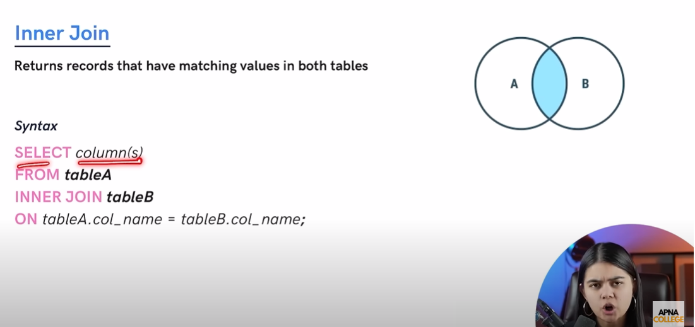
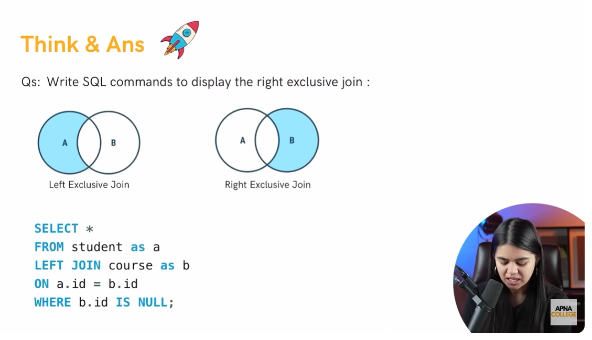

Perfect! Let’s dive into **JOINS in SQL** with **easy-to-understand explanations, examples, real-life use cases, and interview tips**.

---

# SQL JOINS

**JOINS** are used to **combine rows from two or more tables** based on a **related column**.

**Real-life Example:**

* Employees work in departments → Employee table and Department table
* We want to combine employee info with their department info → use JOINS

---

## 1. **Types of Joins**

| Join Type              | Description                                                                          | Example Use Case                                  |
| ---------------------- | ------------------------------------------------------------------------------------ | ------------------------------------------------- |
| **INNER JOIN**         | Returns only matching rows in both tables                                            | Employees with valid departments                  |
| **LEFT (OUTER) JOIN**  | Returns all rows from left table + matching rows from right table (NULL if no match) | All employees, even if department is missing      |
| **RIGHT (OUTER) JOIN** | Returns all rows from right table + matching rows from left table                    | All departments, even if no employee assigned     |
| **FULL (OUTER) JOIN**  | Returns all rows from both tables, NULL where no match                               | Complete employee-department report               |
| **CROSS JOIN**         | Returns Cartesian product of both tables                                             | Combine all employees with all projects           |
| **SELF JOIN**          | Join a table with itself                                                             | Manager-employee hierarchy in same Employee table |

---

## 2. **Example Tables**

### Employee Table

| EmpID | Name         | DeptID | Salary |
| ----- | ------------ | ------ | ------ |
| 1     | Amit Sharma  | 1      | 55000  |
| 2     | Riya Singh   | 2      | 48000  |
| 3     | Vikram Patel | 1      | 60000  |
| 4     | Sana Khan    | NULL   | 45000  |

### Department Table

| DeptID | DepartmentName |
| ------ | -------------- |
| 1      | IT             |
| 2      | HR             |
| 3      | Finance        |

---

## 3. **INNER JOIN**

```sql
SELECT e.Name, d.DepartmentName, e.Salary
FROM Employee e
INNER JOIN Department d
ON e.DeptID = d.DeptID;
```

**Result:**

| Name         | DepartmentName | Salary |
| ------------ | -------------- | ------ |
| Amit Sharma  | IT             | 55000  |
| Vikram Patel | IT             | 60000  |
| Riya Singh   | HR             | 48000  |

**Explanation:** Only employees with a **matching DeptID** are returned.

---

## 4. **LEFT JOIN**

```sql
SELECT e.Name, d.DepartmentName, e.Salary
FROM Employee e
LEFT JOIN Department d
ON e.DeptID = d.DeptID;
```

**Result:**

| Name         | DepartmentName | Salary |
| ------------ | -------------- | ------ |
| Amit Sharma  | IT             | 55000  |
| Vikram Patel | IT             | 60000  |
| Riya Singh   | HR             | 48000  |
| Sana Khan    | NULL           | 45000  |

**Explanation:** Returns **all employees**, even if department is missing.

---

## 5. **RIGHT JOIN**

```sql
SELECT e.Name, d.DepartmentName, e.Salary
FROM Employee e
RIGHT JOIN Department d
ON e.DeptID = d.DeptID;
```

**Result:**

| Name         | DepartmentName | Salary |
| ------------ | -------------- | ------ |
| Amit Sharma  | IT             | 55000  |
| Vikram Patel | IT             | 60000  |
| Riya Singh   | HR             | 48000  |
| NULL         | Finance        | NULL   |

**Explanation:** Returns **all departments**, even if no employee assigned.

---

## 6. **FULL OUTER JOIN** (Some DBMS only, e.g., PostgreSQL)

```sql
SELECT e.Name, d.DepartmentName, e.Salary
FROM Employee e
FULL OUTER JOIN Department d
ON e.DeptID = d.DeptID;
```

**Result:**

| Name         | DepartmentName | Salary |
| ------------ | -------------- | ------ |
| Amit Sharma  | IT             | 55000  |
| Vikram Patel | IT             | 60000  |
| Riya Singh   | HR             | 48000  |
| Sana Khan    | NULL           | 45000  |
| NULL         | Finance        | NULL   |

**Explanation:** Combines **LEFT and RIGHT JOIN** results.

---

## 7. **CROSS JOIN**

```sql
SELECT e.Name, d.DepartmentName
FROM Employee e
CROSS JOIN Department d;
```

**Result:**

* Returns **every employee combined with every department** → Cartesian product

---

## 8. **SELF JOIN**

**Scenario:** Find employees and their managers (same table, ManagerID column).

```sql
SELECT e.Name AS Employee, m.Name AS Manager
FROM Employee e
LEFT JOIN Employee m
ON e.ManagerID = m.EmpID;
```

**Explanation:** Joins table with itself to relate employees with managers.

---

## 9. **Real-life Use Cases**

1. Combine **employees and departments** → INNER or LEFT JOIN
2. Combine **all departments with employees** → RIGHT JOIN
3. Report **all possible project-employee combinations** → CROSS JOIN
4. Hierarchies within same table → SELF JOIN

---

### ✅ Interview Tips

1. Be able to explain **difference between INNER, LEFT, RIGHT, FULL JOIN**
2. Remember **JOINs are based on keys (primary/foreign)**
3. Often asked:

   * “What is the difference between INNER JOIN and LEFT JOIN?”
   * “Can you join a table with itself?” → SELF JOIN

---


Perfect! Let’s create **one complete, placement-ready SQL example** using **JOINS**, **GROUP BY**, **HAVING**, **ORDER BY**, **LIMIT**, and **aggregate functions** together. We’ll use the **Employee** and **Department** tables.

---

# SQL Joins – Full Example

## 1. Employee Table

```sql
CREATE TABLE Employee (
    EmpID INT PRIMARY KEY,
    Name VARCHAR(50),
    DeptID INT,
    Salary DECIMAL(10,2),
    JoiningDate DATE
);

INSERT INTO Employee (EmpID, Name, DeptID, Salary, JoiningDate)
VALUES
(1, 'Amit Sharma', 1, 55000, '2023-06-15'),
(2, 'Riya Singh', 2, 48000, '2022-11-20'),
(3, 'Vikram Patel', 1, 60000, '2021-09-10'),
(4, 'Sana Khan', NULL, 45000, '2024-01-05'),
(5, 'Karan Mehta', 3, 70000, '2020-03-12'),
(6, 'Anita Roy', 2, 52000, '2023-02-18'),
(7, 'Rahul Verma', 1, 53000, '2022-05-30'),
(8, 'Priya Sharma', 3, 65000, '2021-12-11'),
(9, 'Neha Gupta', 2, 47000, '2023-08-01'),
(10, 'Aditya Singh', 1, 58000, '2022-10-22');
```

## 2. Department Table

```sql
CREATE TABLE Department (
    DeptID INT PRIMARY KEY,
    DepartmentName VARCHAR(50)
);

INSERT INTO Department (DeptID, DepartmentName)
VALUES
(1, 'IT'),
(2, 'HR'),
(3, 'Finance'),
(4, 'Marketing');
```

---

## 3. Complete Query Example

**Goal:**

* Show each **department** with **number of employees**, **average salary**, **highest salary**, **lowest salary**
* Include **all departments**, even if no employees
* Only include departments with **average salary > 50000**
* Sort by **average salary descending**
* Return **top 3 departments**

```sql
SELECT 
    d.DepartmentName,
    COUNT(e.EmpID) AS EmployeeCount,
    AVG(e.Salary) AS AvgSalary,
    MAX(e.Salary) AS HighestSalary,
    MIN(e.Salary) AS LowestSalary
FROM Department d
LEFT JOIN Employee e
ON d.DeptID = e.DeptID
GROUP BY d.DepartmentName
HAVING AVG(e.Salary) > 50000
ORDER BY AvgSalary DESC
LIMIT 3;
```

---

## 4. Step-by-Step Explanation

1. **`LEFT JOIN`** → Includes all departments, even if no employees are assigned (like Marketing).

2. **`GROUP BY d.DepartmentName`** → Groups employees by department name.

3. **Aggregate Functions:**

   * `COUNT(e.EmpID)` → number of employees per department
   * `AVG(e.Salary)` → average salary per department
   * `MAX(e.Salary)` → highest salary per department
   * `MIN(e.Salary)` → lowest salary per department

4. **`HAVING AVG(e.Salary) > 50000`** → Filters groups with average salary above 50000.

5. **`ORDER BY AvgSalary DESC`** → Sorts departments by average salary descending.

6. **`LIMIT 3`** → Returns **top 3 departments** only.

---

## 5. Expected Result

| DepartmentName | EmployeeCount | AvgSalary | HighestSalary | LowestSalary |
| -------------- | ------------- | --------- | ------------- | ------------ |
| Finance        | 2             | 67500     | 70000         | 65000        |
| IT             | 4             | 55500     | 60000         | 53000        |

**Explanation:**

* Finance → 2 employees, average 67500
* IT → 4 employees, average 55500
* HR → 3 employees, average 49000 → filtered out by HAVING
* Marketing → 0 employees → filtered out by HAVING

---

## 6. Real-life Use Case

* HR wants a **department-wise salary report**, including all departments
* Can be used in dashboards to highlight **high-paying departments**
* Shows **employee count** for staffing decisions

---

### ✅ Interview Tips

1. **LEFT JOIN vs INNER JOIN** → ensures all departments are included even without employees.
2. **HAVING** → filters aggregated data (cannot use in WHERE).
3. **GROUP BY** → necessary for aggregation per department.
4. **ORDER BY + LIMIT** → useful for top-N queries.
5. This type of **combined query** is often asked in **placements** to test SQL fundamentals.

---


---



---


---


---


---


---


---


---


---



---

Perfect! Let’s go **step by step** and cover **all types of SQL joins** in detail, with **easy-to-understand explanations, real-life examples, and full queries** using the **Employee** and **Department** tables.

---

# SQL JOINS – Detailed Explanation

Joins are used to **combine rows from two or more tables** based on a **related column**.

We will use these **example tables**:

---

## **Employee Table**

| EmpID | Name         | DeptID | Salary |
| ----- | ------------ | ------ | ------ |
| 1     | Amit Sharma  | 1      | 55000  |
| 2     | Riya Singh   | 2      | 48000  |
| 3     | Vikram Patel | 1      | 60000  |
| 4     | Sana Khan    | NULL   | 45000  |
| 5     | Karan Mehta  | 3      | 70000  |
| 6     | Anita Roy    | 2      | 52000  |
| 7     | Rahul Verma  | 1      | 53000  |
| 8     | Priya Sharma | 3      | 65000  |
| 9     | Neha Gupta   | 2      | 47000  |
| 10    | Aditya Singh | 1      | 58000  |

---

## **Department Table**

| DeptID | DepartmentName |
| ------ | -------------- |
| 1      | IT             |
| 2      | HR             |
| 3      | Finance        |
| 4      | Marketing      |

---

## 1. **INNER JOIN**

**Definition:** Returns **only matching rows** from both tables.

**Query:**

```sql
SELECT e.Name, d.DepartmentName, e.Salary
FROM Employee e
INNER JOIN Department d
ON e.DeptID = d.DeptID;
```

**Result:**

| Name         | DepartmentName | Salary |
| ------------ | -------------- | ------ |
| Amit Sharma  | IT             | 55000  |
| Vikram Patel | IT             | 60000  |
| Rahul Verma  | IT             | 53000  |
| Aditya Singh | IT             | 58000  |
| Riya Singh   | HR             | 48000  |
| Anita Roy    | HR             | 52000  |
| Neha Gupta   | HR             | 47000  |
| Karan Mehta  | Finance        | 70000  |
| Priya Sharma | Finance        | 65000  |

**Explanation:**

* Only employees with a valid `DeptID` are returned.
* Employees like **Sana Khan** (DeptID NULL) are excluded.

---

## 2. **LEFT JOIN (LEFT OUTER JOIN)**

**Definition:** Returns **all rows from the left table** + matching rows from right table. If no match, returns **NULL**.

**Query:**

```sql
SELECT e.Name, d.DepartmentName, e.Salary
FROM Employee e
LEFT JOIN Department d
ON e.DeptID = d.DeptID;
```

**Result:**

| Name         | DepartmentName | Salary |
| ------------ | -------------- | ------ |
| Amit Sharma  | IT             | 55000  |
| Vikram Patel | IT             | 60000  |
| Rahul Verma  | IT             | 53000  |
| Aditya Singh | IT             | 58000  |
| Riya Singh   | HR             | 48000  |
| Anita Roy    | HR             | 52000  |
| Neha Gupta   | HR             | 47000  |
| Karan Mehta  | Finance        | 70000  |
| Priya Sharma | Finance        | 65000  |
| Sana Khan    | NULL           | 45000  |

**Explanation:**

* All employees are returned.
* If employee has no department, `DepartmentName` shows **NULL**.

---

## 3. **RIGHT JOIN (RIGHT OUTER JOIN)**

**Definition:** Returns **all rows from the right table** + matching rows from left table. If no match, returns **NULL**.

**Query:**

```sql
SELECT e.Name, d.DepartmentName, e.Salary
FROM Employee e
RIGHT JOIN Department d
ON e.DeptID = d.DeptID;
```

**Result:**

| Name         | DepartmentName | Salary |
| ------------ | -------------- | ------ |
| Amit Sharma  | IT             | 55000  |
| Vikram Patel | IT             | 60000  |
| Rahul Verma  | IT             | 53000  |
| Aditya Singh | IT             | 58000  |
| Riya Singh   | HR             | 48000  |
| Anita Roy    | HR             | 52000  |
| Neha Gupta   | HR             | 47000  |
| Karan Mehta  | Finance        | 70000  |
| Priya Sharma | Finance        | 65000  |
| NULL         | Marketing      | NULL   |

**Explanation:**

* All departments are returned.
* Departments without employees (Marketing) show **NULL** for employee info.

---

## 4. **FULL OUTER JOIN**

**Definition:** Returns **all rows from both tables**, NULL where no match exists.

**Query (PostgreSQL, SQL Server):**

```sql
SELECT e.Name, d.DepartmentName, e.Salary
FROM Employee e
FULL OUTER JOIN Department d
ON e.DeptID = d.DeptID;
```

**Result:**

| Name         | DepartmentName | Salary |
| ------------ | -------------- | ------ |
| Amit Sharma  | IT             | 55000  |
| Vikram Patel | IT             | 60000  |
| Rahul Verma  | IT             | 53000  |
| Aditya Singh | IT             | 58000  |
| Riya Singh   | HR             | 48000  |
| Anita Roy    | HR             | 52000  |
| Neha Gupta   | HR             | 47000  |
| Karan Mehta  | Finance        | 70000  |
| Priya Sharma | Finance        | 65000  |
| Sana Khan    | NULL           | 45000  |
| NULL         | Marketing      | NULL   |

**Explanation:**

* Combines **LEFT** and **RIGHT JOIN** results.
* All employees and all departments included.

---

## 5. **CROSS JOIN**

**Definition:** Returns **Cartesian product** of both tables (all combinations).

**Query:**

```sql
SELECT e.Name, d.DepartmentName
FROM Employee e
CROSS JOIN Department d;
```

**Result:**

* Each employee is combined with **all departments** (10 employees × 4 departments = 40 rows).

**Use Case:**

* Useful when generating **all possible combinations**, e.g., employees × projects.

---

## 6. **SELF JOIN**

**Definition:** Join a table with itself. Often used for **hierarchies**.

**Scenario:** Employee table has **ManagerID** column.

| EmpID | Name         | ManagerID |
| ----- | ------------ | --------- |
| 1     | Amit Sharma  | NULL      |
| 2     | Riya Singh   | 1         |
| 3     | Vikram Patel | 1         |

**Query:**

```sql
SELECT e.Name AS Employee, m.Name AS Manager
FROM Employee e
LEFT JOIN Employee m
ON e.ManagerID = m.EmpID;
```

**Result:**

| Employee     | Manager     |
| ------------ | ----------- |
| Amit Sharma  | NULL        |
| Riya Singh   | Amit Sharma |
| Vikram Patel | Amit Sharma |

**Explanation:**

* Relates employees to their managers **within the same table**.

---

## ✅ Summary Table of Joins

| Join Type       | Returns                                             |
| --------------- | --------------------------------------------------- |
| INNER JOIN      | Only matching rows in both tables                   |
| LEFT JOIN       | All rows from left + matching rows from right       |
| RIGHT JOIN      | All rows from right + matching rows from left       |
| FULL OUTER JOIN | All rows from both tables, NULL where no match      |
| CROSS JOIN      | Cartesian product of both tables                    |
| SELF JOIN       | Table joined with itself (hierarchies, comparisons) |

---

### Interview Tips

1. **Know differences between JOIN types**
2. **LEFT JOIN is more common than RIGHT JOIN**
3. Be ready to explain **FULL OUTER JOIN vs LEFT + RIGHT JOIN**
4. **SELF JOIN** is often asked with hierarchical or reporting data

---


---

Perfect! Let’s focus on **SELF JOIN** in SQL with **detailed explanation, examples, and interview-oriented insights**.

---

# SQL SELF JOIN

A **SELF JOIN** is when a table is joined **with itself**.

* Useful for comparing rows in the same table or showing **hierarchies**.
* Requires **table aliases** to differentiate between “left” and “right” instances of the same table.

---

## 1. **When to Use SELF JOIN**

* Employee-manager relationships
* Comparing rows within the same table
* Finding duplicates or related data inside a table

---

## 2. **Example Table – Employee with ManagerID**

| EmpID | Name         | ManagerID | DeptID | Salary |
| ----- | ------------ | --------- | ------ | ------ |
| 1     | Amit Sharma  | NULL      | 1      | 60000  |
| 2     | Riya Singh   | 1         | 2      | 48000  |
| 3     | Vikram Patel | 1         | 1      | 55000  |
| 4     | Sana Khan    | 2         | 2      | 45000  |
| 5     | Karan Mehta  | 3         | 3      | 70000  |

**Explanation:**

* `ManagerID` refers to `EmpID` of the manager.

---

## 3. **SELF JOIN Query – Employee and Manager**

```sql
SELECT 
    e.Name AS Employee,
    m.Name AS Manager,
    e.Salary
FROM Employee e
LEFT JOIN Employee m
ON e.ManagerID = m.EmpID;
```

**Result:**

| Employee     | Manager      | Salary |
| ------------ | ------------ | ------ |
| Amit Sharma  | NULL         | 60000  |
| Riya Singh   | Amit Sharma  | 48000  |
| Vikram Patel | Amit Sharma  | 55000  |
| Sana Khan    | Riya Singh   | 45000  |
| Karan Mehta  | Vikram Patel | 70000  |

**Explanation:**

* `e` → represents employees
* `m` → represents managers
* `LEFT JOIN` ensures all employees are included, even if no manager exists (`NULL` for Amit Sharma)

---

## 4. **SELF JOIN Use Cases**

1. **Employee-Manager Hierarchy** – Display employees and their managers
2. **Find Pairs** – Compare rows in same table, e.g., products with same price
3. **Detect Duplicates** – Compare columns to find duplicate records

---

## 5. **SELF JOIN with Conditions**

**Example:** Find all employees earning **less than their manager**:

```sql
SELECT 
    e.Name AS Employee,
    m.Name AS Manager,
    e.Salary AS EmployeeSalary,
    m.Salary AS ManagerSalary
FROM Employee e
JOIN Employee m
ON e.ManagerID = m.EmpID
WHERE e.Salary < m.Salary;
```

**Result:**

| Employee     | Manager     | EmployeeSalary | ManagerSalary |
| ------------ | ----------- | -------------- | ------------- |
| Riya Singh   | Amit Sharma | 48000          | 60000         |
| Vikram Patel | Amit Sharma | 55000          | 60000         |
| Sana Khan    | Riya Singh  | 45000          | 48000         |

**Explanation:**

* Compares each employee’s salary with their manager’s salary

---

### ✅ Interview Tips

1. Always use **table aliases** in SELF JOIN
2. Use **LEFT JOIN** if some rows may not have a matching row
3. Common questions:

   * “Show employees with their managers”
   * “Compare rows within same table using SELF JOIN”

---


---

Perfect! Let’s discuss **UNION in SQL** in detail with **examples, real-life use cases, and interview insights**.

---

# SQL UNION

The **`UNION`** operator is used to **combine the results of two or more SELECT queries into a single result set**.

* **Duplicates are removed by default**.
* Columns must have **same number and compatible data types** in all SELECT queries.
* If you want to include duplicates, use **`UNION ALL`**.

---

## 1. **Syntax**

```sql
SELECT column1, column2, ...
FROM table1
WHERE condition

UNION [ALL]

SELECT column1, column2, ...
FROM table2
WHERE condition;
```

---

## 2. **Example – Employee Departments**

Assume we have **two tables** representing employees in **IT** and **HR**:

### IT\_Employees

| EmpID | Name         | DeptID |
| ----- | ------------ | ------ |
| 1     | Amit Sharma  | 1      |
| 3     | Vikram Patel | 1      |
| 7     | Rahul Verma  | 1      |

### HR\_Employees

| EmpID | Name       | DeptID |
| ----- | ---------- | ------ |
| 2     | Riya Singh | 2      |
| 6     | Anita Roy  | 2      |
| 9     | Neha Gupta | 2      |

---

### 3. **UNION Query**

```sql
SELECT Name, DeptID
FROM IT_Employees

UNION

SELECT Name, DeptID
FROM HR_Employees;
```

**Result:**

| Name         | DeptID |
| ------------ | ------ |
| Amit Sharma  | 1      |
| Vikram Patel | 1      |
| Rahul Verma  | 1      |
| Riya Singh   | 2      |
| Anita Roy    | 2      |
| Neha Gupta   | 2      |

**Explanation:**

* Combines **all employees** from IT and HR into a single list
* Removes duplicates if any

---

### 4. **UNION ALL Query**

```sql
SELECT Name, DeptID
FROM IT_Employees

UNION ALL

SELECT Name, DeptID
FROM HR_Employees;
```

**Result:**

* Includes all rows, **even duplicates** (if any)

---

## 5. **Important Points**

1. **Number of columns must match** in all SELECTs
2. **Data types must be compatible**
3. **ORDER BY** can only be used **once at the end**:

```sql
SELECT Name, DeptID
FROM IT_Employees
UNION
SELECT Name, DeptID
FROM HR_Employees
ORDER BY Name;
```

4. **UNION vs JOIN**:

   * **JOIN** → combines **columns** from tables
   * **UNION** → combines **rows** from multiple queries

---

## 6. **Real-life Use Cases**

1. Combine employee lists from **different departments or offices**
2. Combine **sales data from multiple regions**
3. Merge **old and new data tables** for reporting

---

### ✅ Interview Tips

1. Know **difference between UNION and UNION ALL**
2. Remember **column count and data type compatibility**
3. Can be combined with **ORDER BY, LIMIT, WHERE**
4. Common question:

   * “How to combine two tables into a single list without duplicates?” → Use `UNION`

---

Perfect! Let’s create a **complete, placement-ready example using `UNION` in SQL** with a **realistic scenario** and full explanation.

---

# SQL UNION – Full Example

## 1. Example Tables

We have two tables representing **employees from two offices**:

### Office1\_Employees

| EmpID | Name         | Department | Salary |
| ----- | ------------ | ---------- | ------ |
| 1     | Amit Sharma  | IT         | 55000  |
| 2     | Riya Singh   | HR         | 48000  |
| 3     | Vikram Patel | IT         | 60000  |
| 4     | Sana Khan    | HR         | 45000  |

### Office2\_Employees

| EmpID | Name         | Department | Salary |
| ----- | ------------ | ---------- | ------ |
| 5     | Karan Mehta  | Finance    | 70000  |
| 6     | Anita Roy    | HR         | 52000  |
| 7     | Rahul Verma  | IT         | 53000  |
| 8     | Priya Sharma | Finance    | 65000  |

---

## 2. Goal

* Get a **combined list of all employees** from both offices
* Show **Name, Department, Salary**
* Sort by **Salary descending**
* Include **all employees**, no duplicates

---

## 3. UNION Query

```sql
SELECT Name, Department, Salary
FROM Office1_Employees

UNION

SELECT Name, Department, Salary
FROM Office2_Employees
ORDER BY Salary DESC;
```

**Result:**

| Name         | Department | Salary |
| ------------ | ---------- | ------ |
| Karan Mehta  | Finance    | 70000  |
| Priya Sharma | Finance    | 65000  |
| Vikram Patel | IT         | 60000  |
| Amit Sharma  | IT         | 55000  |
| Rahul Verma  | IT         | 53000  |
| Anita Roy    | HR         | 52000  |
| Riya Singh   | HR         | 48000  |
| Sana Khan    | HR         | 45000  |

**Explanation:**

* Combines employees from **both tables**
* Removes duplicates automatically (if any)
* Sorted by **Salary descending**

---

## 4. UNION ALL Query (Including Duplicates)

```sql
SELECT Name, Department, Salary
FROM Office1_Employees

UNION ALL

SELECT Name, Department, Salary
FROM Office2_Employees
ORDER BY Salary DESC;
```

**Difference:**

* Includes **all rows**, even if some employees exist in **both tables**

---

## 5. Real-life Use Case

* Combine **employee lists from multiple branches**
* Combine **current and archived data**
* Combine **sales records from multiple regions**

---

## 6. Tips for Placement/Interview

1. **UNION vs JOIN**:

   * `JOIN` → combines **columns** from multiple tables
   * `UNION` → combines **rows** from multiple queries

2. **Column requirement**:

   * Same number of columns in each SELECT
   * Compatible data types

3. **ORDER BY with UNION**:

   * Only allowed **once at the end**

4. **UNION ALL**:

   * Use when duplicates are acceptable or important

---


---